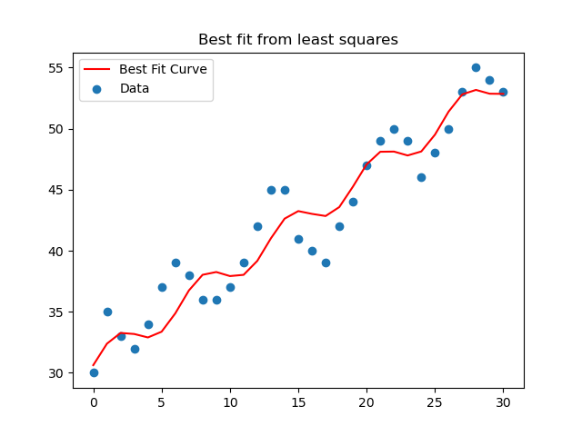
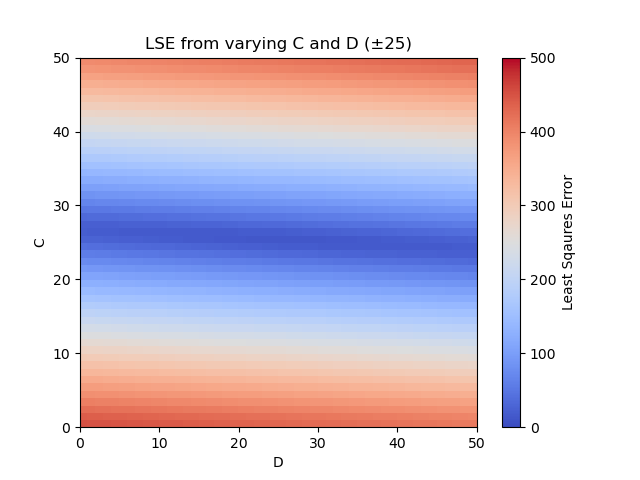
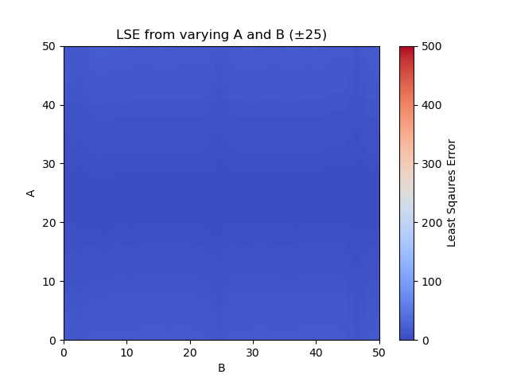
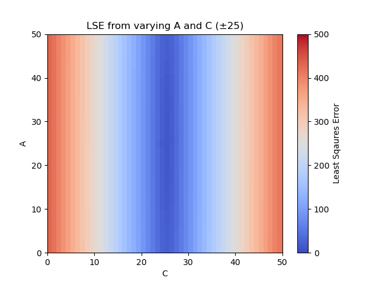
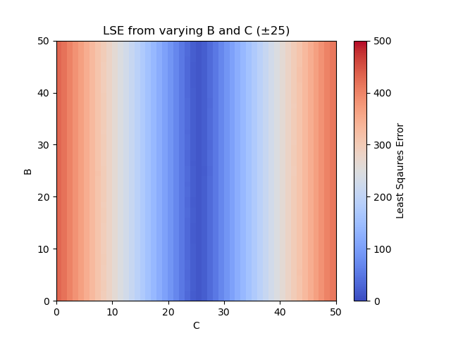
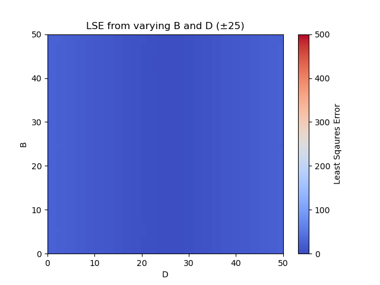
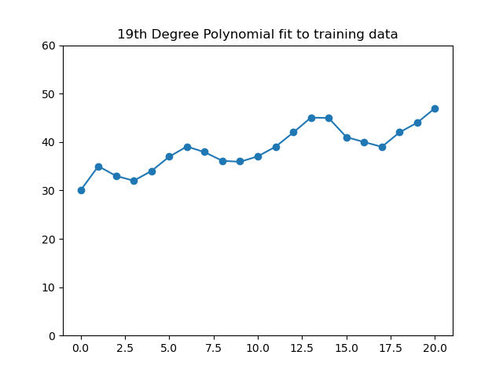
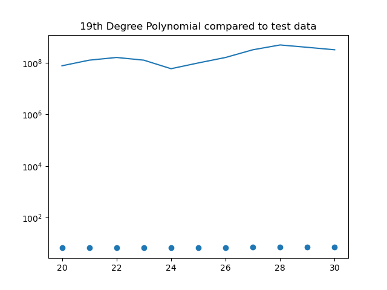
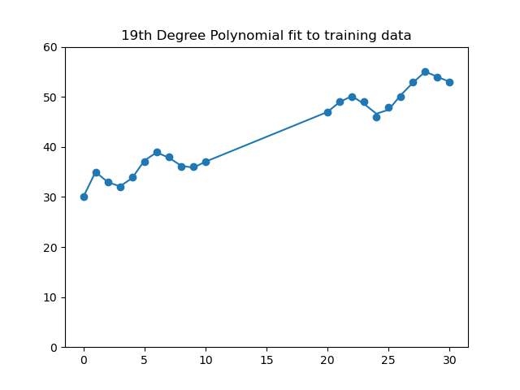
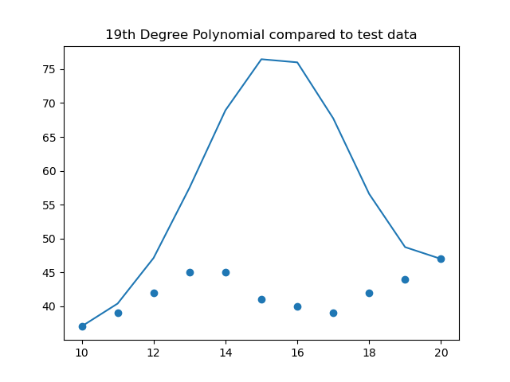

## Author: Kyle Herbruger 
### 4/10/2023
## Machine Learning HW01
### This program is a simple Machine Learning program that fits a curve to a given data set.

This program can iterate over a given data set to find the best curve fit to the data. resently, it only attempts to fit to a simple function that we already know will fit with the data reasonably well (A\*sin(B\*X) + CX + D). It also will attempt to fit to a 19th degree polynomial using the first 20 points as training data with the last 10 being test data, or using the first and last 10 points as training data with the middle 10 points being the test data. In all cases, it will output the Least Squares Error (LSE) to the console. Additionally, it will produce a few plots showing the set equation fit curve on the given data, the resulting LSE of sweeping the A-D parameters ±25 as a color plot, as well as the 19th polynomial fit on the test data and training data. 

## Best fit of the sin function to the data:

# Background:
This task is to teach us how to fit a curve to a data set to recognize the patterns and create a simple machine learning algorithim that can predict other potential points, or verify if other data points are following the pattern. This will be useful to understand for future Machine Learning projects as once we've grouped data, we will need to be able to identify which patterns they belong to, and thus which output they are. 

# Algorithim Implementation and Development:
In this project, I used the least_squares function from scipy.optimize. This optimizes our given parameters (A, B, C, D) to reduce the error according to my objective_dif function which 

# Computational Results:
##Here are my figures showing the results of varying the best fit parameters by 25:

## LSE from varying the C and D variables by ±25:
<small>*\*The plot axes are offset by +25 to prevent a minor bug.*</small>

## LSE from varying the A and B variables by ±25:

## LSE from varying the A and C variables by ±25:

## LSE from varying the B and C variables by ±25:

## LSE from varying the A and D variables by ±25:

## LSE from varying the B and D variables by ±25:

## And my 19th polynomial fit showing the results of training data and test data:

## 19th Degree Polynomial fit to training data (first 20 data points):

## 19th Degree Polynomial fit to test data (last 10 data points):

## 19th Degree Polynomial fit to training data (first and last 10 data points):

## 19th Degree Polynomial fit to test data (middle 20 data points):

# Summary and Conclusions:
In summation, this exercise worked to show us the importance of understanding our data, and how easy it is to overfit a function to the training data. It is important to verify that the equation we are attempting to fit makes sense for the data set, and that we are not making our Machine Learning algorithims fit the training data so well that it cannot handle real test data.

This will be important later on as overfitting data is an easy mistake to make. It's also important to make sure that we have sufficiently large data sets that we can train our ML algorithim well. Ideally, we would want our training set, or ground truth data set, to be as large as possible and our test data set to be larger still.