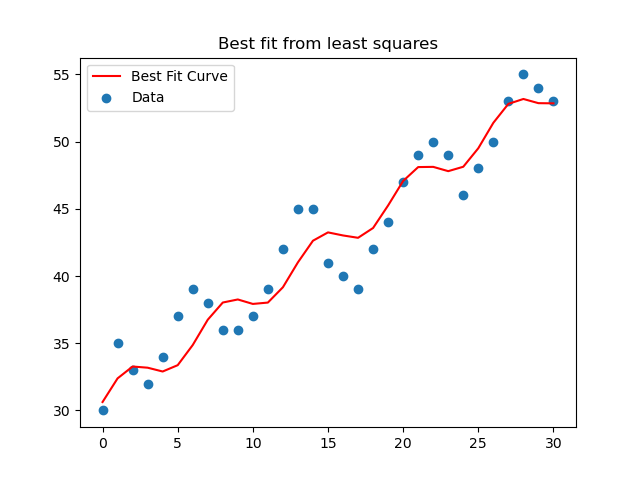

## Author: Kyle Herbruger 
### 4/10/2023
## Machine Learning HW01
### This program is a simple Machine Learning program that fits a curve to a given data set.

This program can iterate over a given data set to find the best curve fit to the data.   
Presently, it only attempts to fit to a simple function that we already know will fit   
with the data reasonably well (A\*sin(B\*X) + CX + D). It also will attempt to fit   
to a 19th degree polynomial using the first 20 points as training data with the last   
10 being test data, or using the first and last 10 points as training data with the middle   
10 points being the test data. In all cases, it will output the Least Squares Error (LSE)   
to the console.

This program fits two functions to a few
different data sets, and I believe it is
to teach us about how to fit data, as 
well as about overfitting data. In part
i, we started off with fitting a sin
function to a given data set, and then
calculated the least squares error to
see how well it fit.

In part ii we varied the parameters of
the sin function we fit to the data,
and calculated the LSE for each result.
This showed how different parameters
had different impacts on the LSE.
The A and C variables had the greatest
impact, while B and D, which still
greatly impacted the LSE, were almost
insignificant in comparison.

In part iii we trained a 19th degree
polynomial to fit the first 20 data 
points, and then compared its LSE
on the training data to that of the
test data (the last 10 points).
While the training data had a really
good LSE, the test data LSE was worse 
than my mental health.

In part iv we repeated part iii with
the first and last 10 data points as
training data, and the middle 10 as 
the test data. This approach gave
a much better LSE for the test data,
however, it did negatively impact
the LSE for the training data. 

In either case, fitting with the wrong
function can easily cause overfitting
problems.