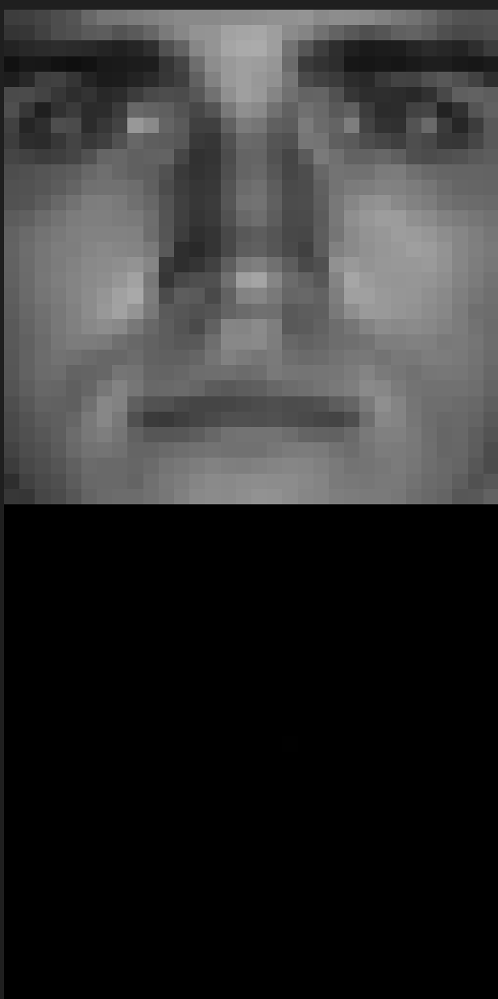

## Author: Kyle Herbruger 
### 4/18/2023
## Machine Learning HW02
### This program processes yalefaces.mat which is a set of 2414 faces, downscaled to 32x32.

This program will process the first 100 faces in the image set, and produce a correlation matrix showing how strongly each face is correlated to one  another. From there, it will produce the most and least correlated faces.

## Correlation Matrix

This plot shows the correlation between the first 100 faces. Each image has been normalized to account for different overall brightness levels, and then is compared to another face using the dot product. For this reason, the diagonal has perfect correlation due to comparing a face to itself.

## Faces total correlation

This plot shows the total correlation value of all the different faces.

## Best and worst correlated

These are the best and worst correlated faces in the data set.

## 10x10 corMat

This is similar to the above correlation matrix, however, it is for a predetermined set of faces (1, 313, 512, 5, 2400, 113, 1024, 87, 314, 2005).

## The first 6 SVD modes

These are the first 6 most prominent SVD vectors for all of the faces.

## First 6 SVD vectors variance

This plot shows the variance of each of the 6 vectors. As can be seen, they rapidly decrease in variance, showing that the first vector is the most significant, with later ones have a smaller impact.

# Summary and Conclusion
This exercise worked to show us how to process images and identify ways to compare them. This exercise, taken to an extreme for real world applications, could be used for a machine learning model to predict if someone goes to Yale or not. While this data set is incredibly small, has significant genotype bias, and requires a highly tailored input, it has potential.